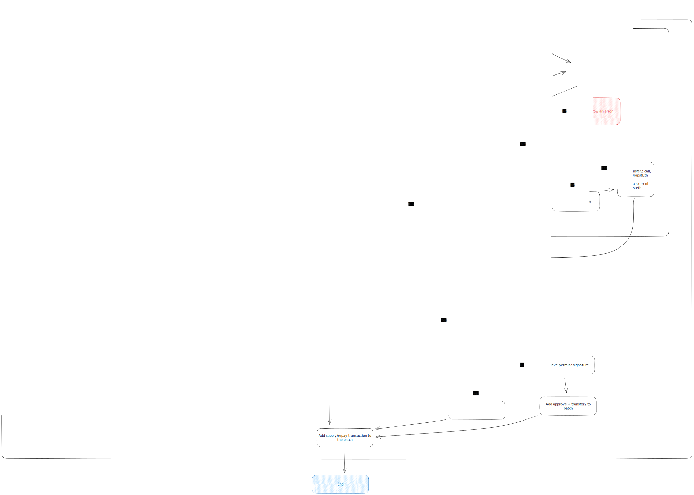

# Bulker

Bulker is a contract build on top of Morpho Aave v3 ETH Optimizer 
that permits to bundle Morpho transaction in a single transaction.

It uses the "manager" feature of Morpho to execute borrow and withdraw on behalf of the user.

The principle is quite simple: 
- for supply / repay, the user send tokens to the bulker and the bulker supply/repay on behalf
- for borrow / withdraw, the bulker must be enabled as manager through a user signature and will 
    execute the borrow / withdraw on behalf of the user.
- stEth and eth can be used (not wrapped). So the bulker is at the same time an ETH gateway.

The bulker acts as a gateway and never hold any token.

## How to use it
The SDK provides a `Bulker` class that can be used to interact with the bulker contract.
The class is hiding all the complexity of a simple supply/borrow/withdraw/repay.
So you can use it only by providing Morpho transactions, and the SDK will wrap, transfer etc to the bulker.

### Signatures
Each transfer and Bulker manager approval necessitate a signature
from the user. A hook must be provided to the bulker constructor in order to handle signatures when needed.

### Supply / Repay

    

### Borrow / Withdraw

    

### Specifications

